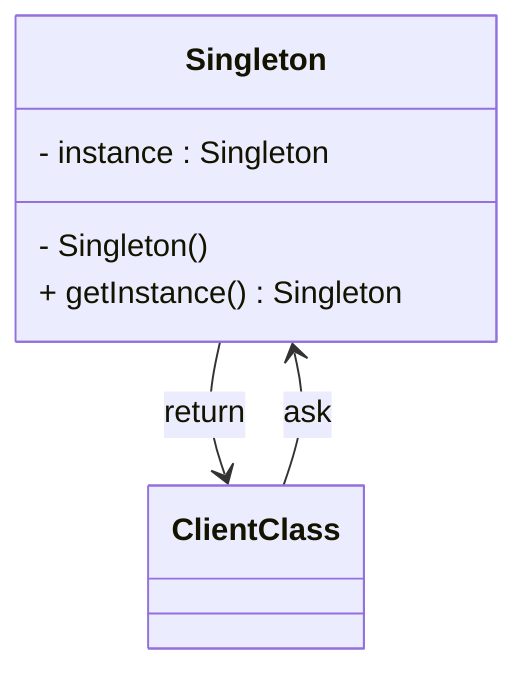
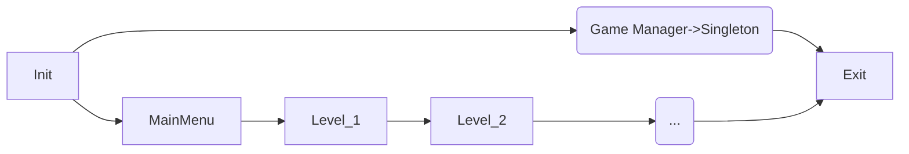

# Singleton
Głównym celem singletona jest to by zagwarantować jednorazowe wystąpienie jego obiektu. To znaczy, sam singleton będzie wykrywał próbę stworzenia drugiej instancji a nastęnie ją usuwał. Jest on pomocny kiedy chcemy stworzyć globany system do kontrolowania np. Muzyki, Stanów Gry, ... itd. , który będzie dostępny z każdego miejsca w kodzie. Sigleton jest klasą abstakcyjną, wiec nie da się stworzyć jego instancji. Dopiero po dziedziczeniu moża sworzyć obiekt tej klasy.



## Zalety i Wady
---
#### Zalety
- **Dostępny Globalnie** - możemy użyć singletona by mieć dostęp z każdego miejsca w kodzie do zaimplementowanych przez nas narzędziach np. Do odtwarzacza muzyki, do zasobów w grze(do importowania plików z folderu ***Resource***).
- **Kontrolujesz równoczeny dostęp do zasobów** -  może być wykorzystywany do ograniczenia równoczesnego korzystania ze wspólnych zasobów.
#### Wady
- **Testy Jednostkowe** - nadmiar singletonów może uczynić testy uciążliwymi. Zwłaszcza jeżeli jedne singletony zależą od drugich. Tworzymy wtedy łańcuch zależoność, który utrudnia nam testowanie wydzielonych funkcji gry.
- **Lenistwo** - singleton jest łatwy do implementacji i dzieki niemu można w łatwy sposób mieć dostęp do wybrancy obiektów w całym kodzie. Może to powodować, że zamiast stosować bardziej optymalne metody, to będzemy wyszystko wrzucać do singletona.


##### Cykl życia Singletona
Jest on tworzony na początku gry i towarzyszy nam przez wszystkie sceny aż do zakończenia rozgrywki



### Przykładowy KOD
---
#### Przykładowy Singleton
```CS

using UnityEngine;

namespace Chapter.Singleton
{
    public class  Singleton<T> : 
        MonoBehaviour where T : Component {
        
        private static T _instance;

        public static T Instance
        {
            get
            {
                if (_instance == null)
                {
                    _instance = FindObjectOfType<T>();

                    if (_instance == null)
                    {
                        GameObject obj = new GameObject();
                        obj.name = typeof(T).Name;
                        _instance = obj.AddComponent<T>();
                    }
                }

                return _instance;
            }
        }

        public virtual void Awake()
        {
            if (_instance == null)
            {
                _instance = this as T;
                DontDestroyOnLoad(gameObject);
            }
            else
            {
                Destroy(gameObject);
            }
        }
    }
}
```

#### Przykładowa klasa korzystające z Singletona
```CS
using System;
using UnityEngine;
using UnityEngine.SceneManagement;

namespace Chapter.Singleton
{
    public class GameManager : Singleton<GameManager>
    {
        private DateTime _sessionStartTime;
        private DateTime _sessionEndTime;
        public string text;

        void Start()
        {
            Debug.Log(GameSettings.ComputerPlayOnLeft);
            GameSettings.ComputerPlayOnLeft = true;

            _sessionStartTime = DateTime.Now;
            Debug.Log(
                "Game session start @: " + DateTime.Now);
        }

        void OnApplicationQuit()
        {
            _sessionEndTime = DateTime.Now;

            TimeSpan timeDifference =
                _sessionEndTime.Subtract(_sessionStartTime);

            Debug.Log(
                "Game session ended @: " + DateTime.Now);
            Debug.Log(
                "Game session lasted: " + timeDifference);
        }

        void OnGUI()
        {
            if (GUILayout.Button("Next Scene"))
            {
                SceneManager.LoadScene(
                    SceneManager.GetActiveScene().buildIndex + 1);
            }
        }
    }
}
```